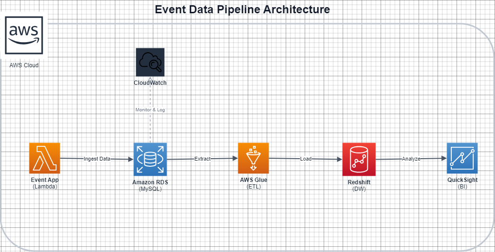

# 이벤트 로그 파이프라인

온라인 강의 판매 플랫폼의 수강생 행동 이벤트를 생성하고, MySQL에 저장하고, 집계 분석 및 시각화하는 데이터 파이프라인입니다.

## 전체 파이프라인 구조

```
[Step 1] 이벤트 생성         event_generator.py
              ↓
[Step 2] MySQL 저장          save_to_db.py  ←→  MySQL (Docker)
              ↓
[Step 3] 집계 분석           Metabase SQL Query
              ↓
[Step 5] 시각화              Metabase Dashboard
```

---

## 실행 방법

**필요 도구:** Docker Desktop

```bash
# 1. 전체 스택 실행 (MySQL + 이벤트 생성 및 저장 + Metabase)
docker compose up --build

# 백그라운드만 실행하고 싶을 때
docker compose up -d

# 재실행 시 (DB 초기화 포함)
docker compose down -v
docker compose up --build
```

실행 후 자동으로 동작하는 순서:
1. MySQL 컨테이너 기동 및 스키마 자동 생성 (`init.sql`)
2. Python 앱이 이벤트 1,000건 생성 후 MySQL 저장
3. Metabase 대시보드 → `http://localhost:3000` 접속

---

## Step 1. 이벤트 생성기

**파일:** `event_generator.py`

라이브클래스와 유사한 교육 도메인에서 이벤트를 설계하는 것이 더 의미 있는 분석 결과로 이어질 수 있다고 판단했습니다. 향후 실제 업무와의 연관성까지 고려했을 때, 인강·교육 데이터를 기반으로 접근하는 것이 적절하다고 보아 해당 도메인으로 프로젝트를 시작했습니다.

이벤트 타입을 정의하기 위해 교육 플랫폼에서 핵심적으로 봐야 할 지표를 고민했습니다. 그 결과 단순 매출보다 **완강률**이 더 중요한 지표라고 판단했습니다. 강의 구매는 일회성 성과에 그칠 수 있지만, 완강은 사용자가 실제로 가치를 소비했음을 의미하며 플랫폼의 지속적인 성장과 직결된다고 보았기 때문입니다.

### 이벤트 타입 (5가지)

| 이벤트 | 비율 | 목적 |
|---|---|---|
| `lecture_play` | 40% | 학습 행동 추적 |
| `lecture_complete` | 25% | 완강률 측정 |
| `course_purchase` | 20% | 매출 분석 |
| `review_submit` | 10% | 사용자 만족도 |
| `error` | 5% | 서비스 안정성 모니터링 |

비율은 실제 교육 플랫폼의 사용자 행동 흐름을 반영해 설계했습니다.

- `lecture_play` **(40%)** — 강의 재생은 수강생이 가장 빈번하게 일으키는 행동으로 가장 높게 설정했습니다.
- `lecture_complete` **(25%)** — 재생 대비 낮은 비율로 설정해 현실적인 완강률(약 62.5%)이 자연스럽게 나오도록 했습니다.
- `course_purchase` **(20%)** — 핵심 전환 행동이지만 재생보다는 덜 빈번하게 발생하므로 20%로 설정했습니다.
- `review_submit` **(10%)** — 구매 후 일부 수강생만 리뷰를 작성하는 현실을 반영했습니다.
- `error` **(5%)** — 정상적인 서비스에서 에러는 드물게 발생해야 하므로 가장 낮게 설정했습니다.

### 공통 필드

모든 이벤트는 아래 공통 필드를 포함합니다:

| 필드 | 설명 |
|---|---|
| `event_id` | 고유 식별자 |
| `event_type` | 이벤트 종류 |
| `user_id` | 수강생 ID (200명) |
| `session_id` | 접속 세션 식별자 |
| `timestamp` | 이벤트 발생 시각 |
| `device_type` | 접속 기기 (desktop / mobile / tablet) |

---

## Step 2. 로그 저장

**파일:** `save_to_db.py`, `init.sql`

### 저장소 선택 이유

MySQL을 DBeaver로 연결해 사용했습니다. RDB로서 운영하기 편하고 오픈소스이기에 다루기 쉬웠으며, 추후 BigQuery 혹은 CDC 연결 등의 확장성을 고려했을 때도 어렵지 않게 쓸 수 있다고 판단했습니다. 또한 빠른 데이터 분석과 시각화, Docker와의 호환성을 고려했을 때 가장 적합하다고 생각했습니다.

### 스키마 설계

이벤트 종류마다 필요한 필드가 다르기 때문에, **공통 필드는 `events` 테이블에 모으고 이벤트 타입별 고유 필드는 별도 상세 테이블로 분리**했습니다. 하나의 테이블에 모든 필드를 넣으면 대부분의 컬럼이 NULL로 낭비되기 때문입니다. 

`event_id`를 PK이자 FK로 사용해 두 테이블을 연결하며, 자주 쓰는 `event_type`, `user_id`, `timestamp` 컬럼에 인덱스를 걸어 집계 쿼리 성능을 높였습니다.

| 테이블 | 설명 | 주요 컬럼 |
|---|---|---|
| `events` | 모든 이벤트의 공통 필드를 저장하는 중심 테이블 | event_id, event_type, user_id, session_id, timestamp, device_type |
| `event_course_purchase` | 수강생이 강의를 결제했을 때 기록 | course_id, course_title, price, payment_method, category |
| `event_lecture_play` | 수강생이 강의 영상을 재생했을 때 기록 | course_id, lecture_id, playback_quality, progress_seconds |
| `event_lecture_complete` | 수강생이 강의 영상을 완강했을 때 기록 | course_id, lecture_id, total_duration_seconds, watch_duration_seconds |
| `event_review_submit` | 수강생이 강의 수강 후 리뷰를 작성했을 때 기록 | course_id, rating, review_text |
| `event_error` | 서비스 이용 중 에러가 발생했을 때 기록 | error_code, error_message, page_url |

### DBeaver에 저장된 데이터（`event_course_purchase`）


---

## Step 3. 집계 분석

집계 분석은 Metabase의 SQL Query 기능을 통해 진행했습니다.

### 분석 1. 강의별 매출 & 구매 횟수
어떤 강의가 가장 많이 팔리고 매출이 높은지 파악합니다.

```sql
SELECT
    course_id,
    course_title,
    category,
    COUNT(*) AS purchase_count,
    SUM(price) AS total_revenue
FROM
    event_course_purchase
GROUP BY
    course_id, course_title, category
ORDER BY
    total_revenue DESC
```

### 분석 2. 시간대별 이벤트 추이
사용자가 언제 가장 활발히 활동하는지 파악합니다. 마케팅/푸시알림 발송 시간 최적화에 활용할 수 있습니다.

```sql
SELECT
    HOUR(timestamp) AS hour,
    COUNT(*) AS event_count
FROM
    events
GROUP BY
    HOUR(timestamp)
ORDER BY
    hour
```

### 분석 3. 강의별 완강률
재생 대비 완강 비율을 측정합니다. 완강률이 낮은 강의는 콘텐츠 품질 개선이 필요하다는 신호입니다.

```sql
SELECT
    p.course_id,
    cp.course_title,
    p.play_count,
    COALESCE(c.complete_count, 0) AS complete_count,
    ROUND(COALESCE(c.complete_count, 0) / p.play_count * 100, 1) AS completion_rate_pct
FROM (
    SELECT
        course_id,
        COUNT(*) AS play_count
    FROM
        event_lecture_play
    GROUP BY
        course_id
) p
LEFT JOIN (
    SELECT
        course_id,
        COUNT(*) AS complete_count
    FROM
        event_lecture_complete
    GROUP BY
        course_id
) c ON p.course_id = c.course_id
LEFT JOIN (
    SELECT
        DISTINCT course_id,
        course_title
    FROM
        event_course_purchase
) cp ON p.course_id = cp.course_id
ORDER BY
      completion_rate_pct DESC
```

> 완강률을 어떻게 계산해야 할지 처음에는 막막했습니다.

`lecture_play`와 `lecture_complete`는 서로 직접 연결된 키가 없기 때문에 단순 JOIN이 불가능했습니다.

결국 두 테이블을 각각 `course_id` 기준으로 집계한 뒤 LEFT JOIN하는 방식으로 해결했습니다.

또한 강의명(`course_title`)이 `event_course_purchase`에만 존재하는 구조적 한계가 있어, 차트 레이블 표시를 위해 해당 테이블을 한 번 더 JOIN했습니다.

---

## Step 4. Docker 구성

**파일:** `docker-compose.yml`, `Dockerfile`

`docker compose up` 한 번으로 아래 3개 서비스가 함께 실행됩니다:

| 서비스 | 역할 |
|---|---|
| `mysql` | 이벤트 로그 저장소 (port 3307) |
| `app` | 이벤트 생성 및 MySQL 저장 (자동 실행 후 종료) |
| `metabase` | 집계 분석 및 시각화 대시보드 (port 3000) |

---

## Step 5. 시각화

`docker compose up` 실행 후 `http://localhost:3000` 에서 Metabase에 접속합니다.

**DB 연결 설정:**

| 항목 | 값 |
|---|---|
| Type | MySQL |
| Host | `mysql` |
| Port | `3306` |
| Database | `liveclas_events` |
| Username | `pipeline` |
| Password | `pipeline123` |

Step 3의 쿼리 3개를 각각 Bar chart / Line chart로 저장한 뒤 대시보드에 구성했습니다.

**Metabase를 선택한 이유**

Metabase는 MySQL과 직접 연결되어 별도 코드 없이 SQL 결과를 바로 시각화할 수 있습니다.
또한 대시보드 자동 새로고침 기능을 통해 이벤트 데이터가 쌓일 때마다 실시간으로 현황을 모니터링할 수 있다는 점도 큰 장점입니다.

**완강률 차트 구성 시 고민한 점**

재생 수(`play_count`)와 완강 수(`complete_count`)는 절대적인 수치이고, 완강률(`completion_rate_pct`)은 0~100%의 비율입니다.

두 지표를 단일 축에 표현하면 수치 차이로 인해 완강률이 시각적으로 묻혀버리는 문제가 있었습니다.

이를 해결하기 위해 재생 수는 Bar chart로, 완강률은 보조 축을 활용한 Line chart로 이중 표현해 두 지표가 모두 명확하게 드러나도록 구성했습니다.


---

# AWS 아키텍처 설계 (AWS)

확장성과 안정성을 갖추기 위한 AWS 기반의 클라우드 아키텍처 설계도입니다.



| AWS 서비스 | 역할 및 선정 이유 |
|:---:|---|
| **Lambda** | **이벤트 수집**: 서버리스 기반으로 트래픽에 따라 자동 확장되며 비용 효율적인 데이터 수집 수행 |
| **RDS (MySQL)** | **운영 스토리지**: 누락 없는 데이터 기록을 위한 신뢰성 높은 완전 관리형 관계형 DB(OLTP) |
| **AWS Glue** | **ETL 프로세스**: 데이터 추출·변환·적재 작업을 자동화하여 데이터 웨어하우스로 전송 |
| **Redshift** | **데이터 웨어하우스**: 대규모 데이터셋에 대한 고성능 분석 쿼리 처리에 최적화(OLAP) |
| **QuickSight** | **비즈니스 분석**: Redshift와 완벽하게 통합되는 서버리스 BI 도구로 인사이트 도출 |
| **CloudWatch** | **모니터링**: 전체 파이프라인의 로그 수집, 상태 감시 및 에러 알람 처리 |

### 💡 핵심 설계 의사결정 (Rationale)

아키텍처 설계 과정에서 가장 고민했던 기술적 선택과 그에 대한 근거입니다.

**1. 왜 Lambda인가? (Compute)**
- **이벤트 기반 처리**: 24시간 상시 운영되는 EC2나 ECS보다, 이벤트가 발생할 때만 즉각 실행되는 **서버리스(Serverless)** 방식이 파이프라인의 성격에 더 적합하다고 판단했습니다.
- **클라우드 네이티브**: GCP의 **Cloud Run**과 유사한 실행 모델을 지향하며, 관리 부담을 최소화하고 비용 효율성을 극대화하기 위해 AWS Lambda를 최종 선택했습니다.

**2. 왜 Redshift와 Glue가 필요한가? (DW & ETL)**
- **OLAP 성능 최적화**: 데이터 규모가 커질수록 운영 DB(RDS)만으로는 복잡한 집계 및 분석에 한계가 있습니다. 서비스 성능에 영향을 주지 않으면서 대규모 조회를 수행하기 위해 별도의 **데이터 웨어하우스(DW)** 인 Redshift를 도입했습니다.
- **파이프라인 자동화**: RDS에서 Redshift로의 유기적인 데이터 흐름을 위해 전문적인 ETL 프로세스가 필수적이라고 판단했습니다. 이를 자동화하고 확장성을 확보하기 위해 **AWS Glue**를 연동했습니다.

---

# Kubernetes 리소스 설정 파일 작성

이벤트 생성기 앱을 클러스터 환경에서 안정적으로 운영하기 위한 쿠버네티스(Kubernetes) 설정 파일입니다.

### 1. 선택한 Kubernetes 리소스와 설정 내용

**1) Deployment.yaml (앱 배포 및 상태 관리)**
이벤트 생성기(`event_generator.py`)가 담긴 도커 이미지를 쿠버네티스 상에서 몇 개를 띄울지, 어떤 자원을 사용할지 정의합니다.

```yaml
apiVersion: apps/v1
kind: Deployment
metadata:
  name: event-generator-deployment
  labels:
    app: event-generator
spec:
  replicas: 2  # 가용성을 위해 2개의 포드(Pod)를 띄웁니다.
  selector:
    matchLabels:
      app: event-generator
  template:
    metadata:
      labels:
        app: event-generator
    spec:
      containers:
      - name: event-generator
        image: hyunwoo/event-generator:v1  # 도커 이미지 주소(예시)
        ports:
        - containerPort: 8080
        resources:
          requests:
            memory: "64Mi"
            cpu: "250m"
          limits:
            memory: "128Mi"
            cpu: "500m"
```

**2) Service.yaml (네트워크 통신 설정)**
배포된 이벤트 생성기 파드들이 외부나 내부의 다른 서비스(MySQL 등)와 안정적으로 통신할 수 있도록 고정된 통로를 열어줍니다.

```yaml
apiVersion: v1
kind: Service
metadata:
  name: event-generator-service
spec:
  selector:
    app: event-generator
  ports:
    - protocol: TCP
      port: 80        # 서비스가 노출될 포트
      targetPort: 8080 # 컨테이너 내부 포트
  type: ClusterIP      # 클러스터 내부에서만 통신할 때 사용 (외부 노출 시 LoadBalancer)
```

### 2. Kubernetes 리소스를 선택한 이유 (핵심 설계 고민)
단순한 실행을 넘어, 실제 데이터 엔지니어링 파이프라인의 안정적인 운영을 염두에 두고 리소스를 설계했습니다.

- **배포 전략 고민 (고가용성)**: 이벤트 생성기는 상시 가동되어야 하므로 `Deployment`의 `replicas`를 2로 설정하여, 파드 하나가 죽더라도 파이프라인이 멈추지 않고 지속되도록 설계했습니다.
- **리소스 최적화**: 데이터 엔지니어링 파이프라인에서 자원 낭비를 줄이고 클러스터를 효율적으로 운영하기 위해, `requests`와 `limits`를 명시하여 자원 할당을 세밀하게 제어했습니다.
- **환경 변수 관리 계획**: 당장 코드로 구현하지는 않았지만, 데이터베이스 접속 정보와 같은 민감 정보는 향후 `ConfigMap`이나 `Secret` 리소스로 분리하여 안전하고 유연하게 관리하는 방향으로 확장할 계획입니다.
