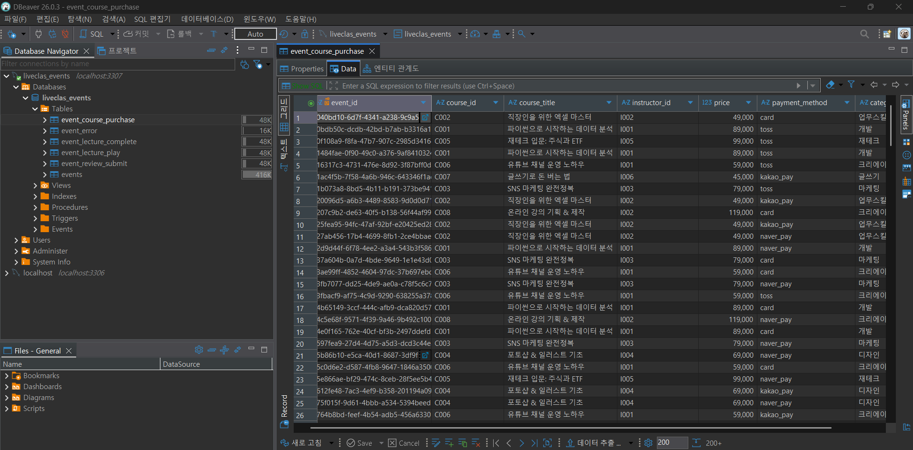
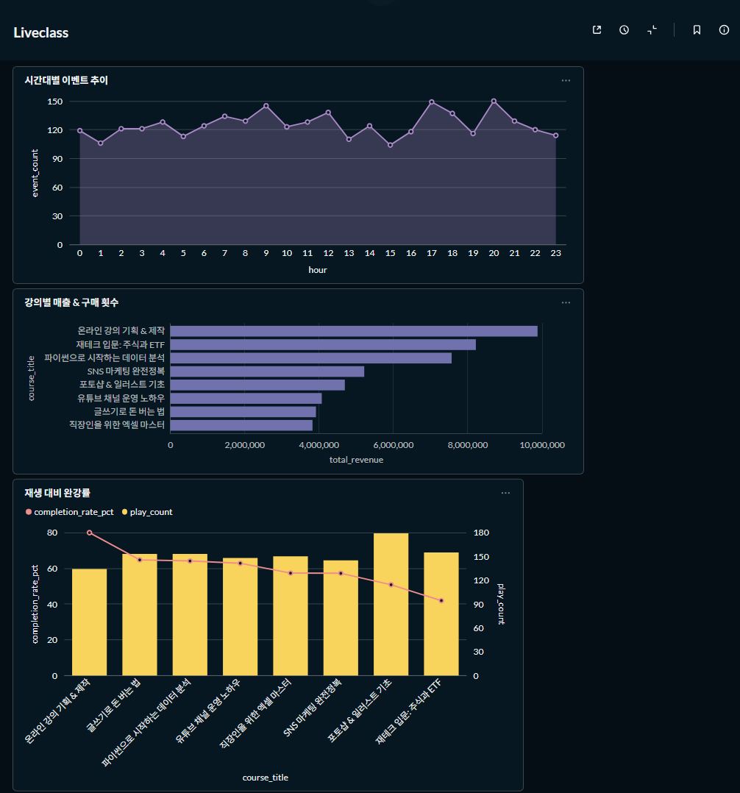

# 이벤트 로그 파이프라인

온라인 강의 판매 플랫폼의 수강생 행동 이벤트를 생성하고, MySQL에 저장하고, 집계 분석 및 시각화하는 데이터 파이프라인입니다.

## 전체 파이프라인 구조

```
[Step 1] 이벤트 생성         event_generator.py
              ↓
[Step 2] MySQL 저장          save_to_db.py  ←→  MySQL (Docker)
              ↓
[Step 3] 집계 분석           Metabase SQL Query
              ↓
[Step 5] 시각화              Metabase Dashboard
```

---

## 실행 방법

**필요 도구:** Docker Desktop

```bash
# 1. 전체 스택 실행 (MySQL + 이벤트 생성 및 저장 + Metabase)
docker compose up --build

# 백그라운드만 실행하고 싶을 때
docker compose up -d

# 재실행 시 (DB 초기화 포함)
docker compose down -v
docker compose up --build
```

실행 후 자동으로 동작하는 순서:
1. MySQL 컨테이너 기동 및 스키마 자동 생성 (`init.sql`)
2. Python 앱이 이벤트 1,000건 생성 후 MySQL 저장
3. Metabase 대시보드 → `http://localhost:3000` 접속

---

## Step 1. 이벤트 생성기

**파일:** `event_generator.py`

라이브클래스와 유사한 교육 도메인에서 이벤트를 설계하는 것이 더 의미 있는 분석 결과로 이어질 수 있다고 판단했습니다. 향후 실제 업무와의 연관성까지 고려했을 때, 인강·교육 데이터를 기반으로 접근하는 것이 적절하다고 보아 해당 도메인으로 프로젝트를 시작했습니다.

이벤트 타입을 정의하기 위해 교육 플랫폼에서 핵심적으로 봐야 할 지표를 고민했습니다. 그 결과 단순 매출보다 **완강률**이 더 중요한 지표라고 판단했습니다. 강의 구매는 일회성 성과에 그칠 수 있지만, 완강은 사용자가 실제로 가치를 소비했음을 의미하며 플랫폼의 지속적인 성장과 직결된다고 보았기 때문입니다.

### 이벤트 타입 (5가지)

| 이벤트 | 비율 | 목적 |
|---|---|---|
| `lecture_play` | 40% | 학습 행동 추적 |
| `lecture_complete` | 25% | 완강률 측정 |
| `course_purchase` | 20% | 매출 분석 |
| `review_submit` | 10% | 사용자 만족도 |
| `error` | 5% | 서비스 안정성 모니터링 |

### 공통 필드

모든 이벤트는 아래 공통 필드를 포함합니다:

| 필드 | 설명 |
|---|---|
| `event_id` | UUID 기반 고유 식별자 |
| `event_type` | 이벤트 종류 |
| `user_id` | 수강생 ID (200명) |
| `session_id` | 접속 세션 식별자 |
| `timestamp` | 이벤트 발생 시각 |
| `device_type` | 접속 기기 (desktop / mobile / tablet) |

---

## Step 2. 로그 저장

**파일:** `save_to_db.py`, `init.sql`

### 저장소 선택 이유

MySQL을 DBeaver로 연결해 사용했습니다. RDB로서 운영하기 편하고 오픈소스이기에 다루기 쉬웠으며, 추후 BigQuery 혹은 CDC 연결 등의 확장성을 고려했을 때도 어렵지 않게 쓸 수 있다고 판단했습니다. 또한 빠른 데이터 분석과 시각화, Docker와의 호환성을 고려했을 때 가장 적합하다고 생각했습니다.

### 스키마 설계

이벤트 종류마다 필요한 필드가 다르기 때문에, **공통 필드는 `events` 테이블에 모으고 이벤트 타입별 고유 필드는 별도 상세 테이블로 분리**했습니다. 하나의 테이블에 모든 필드를 넣으면 대부분의 컬럼이 NULL로 낭비되기 때문입니다. `event_id`(UUID)를 PK이자 FK로 사용해 두 테이블을 연결하며, 자주 쓰는 `event_type`, `user_id`, `timestamp` 컬럼에 인덱스를 걸어 집계 쿼리 성능을 높였습니다.

| 테이블 | 설명 | 주요 컬럼 |
|---|---|---|
| `events` | 모든 이벤트의 공통 필드를 저장하는 중심 테이블 | event_id, event_type, user_id, session_id, timestamp, device_type |
| `event_course_purchase` | 수강생이 강의를 결제했을 때 기록 | course_id, course_title, price, payment_method, category |
| `event_lecture_play` | 수강생이 강의 영상을 재생했을 때 기록 | course_id, lecture_id, playback_quality, progress_seconds |
| `event_lecture_complete` | 수강생이 강의 영상을 완강했을 때 기록 | course_id, lecture_id, total_duration_seconds, watch_duration_seconds |
| `event_review_submit` | 수강생이 강의 수강 후 리뷰를 작성했을 때 기록 | course_id, rating, review_text |
| `event_error` | 서비스 이용 중 에러가 발생했을 때 기록 | error_code, error_message, page_url |

### 저장된 DB



---

## Step 3. 집계 분석

집계 분석은 Metabase의 SQL Query 기능을 통해 진행했습니다.

### 분석 1. 강의별 매출 & 구매 횟수
어떤 강의가 가장 많이 팔리고 매출이 높은지 파악합니다.

```sql
SELECT
    course_id,
    course_title,
    category,
    COUNT(*) AS purchase_count,
    SUM(price) AS total_revenue
FROM
    event_course_purchase
GROUP BY
    course_id, course_title, category
ORDER BY
    total_revenue DESC
```

### 분석 2. 시간대별 이벤트 추이
사용자가 언제 가장 활발히 활동하는지 파악합니다. 마케팅/푸시알림 발송 시간 최적화에 활용할 수 있습니다.

```sql
SELECT
    HOUR(timestamp) AS hour,
    COUNT(*) AS event_count
FROM
    events
GROUP BY
    HOUR(timestamp)
ORDER BY
    hour
```

### 분석 3. 강의별 완강률
재생 대비 완강 비율을 측정합니다. 완강률이 낮은 강의는 콘텐츠 품질 개선이 필요하다는 신호입니다.

```sql
SELECT
    p.course_id,
    cp.course_title,
    p.play_count,
    COALESCE(c.complete_count, 0) AS complete_count,
    ROUND(COALESCE(c.complete_count, 0) / p.play_count * 100, 1) AS completion_rate_pct
FROM (
    SELECT
        course_id,
        COUNT(*) AS play_count
    FROM
        event_lecture_play
    GROUP BY
        course_id
) p
LEFT JOIN (
    SELECT
        course_id,
        COUNT(*) AS complete_count
    FROM
        event_lecture_complete
    GROUP BY
        course_id
) c ON p.course_id = c.course_id
LEFT JOIN (
    SELECT
        DISTINCT course_id,
        course_title
    FROM
        event_course_purchase
) cp ON p.course_id = cp.course_id
ORDER BY
      completion_rate_pct DESC
```

> `event_lecture_play`와 `event_lecture_complete`는 서로 직접 연결된 키가 없어, 각각 `course_id` 기준으로 집계한 뒤 JOIN하는 방식으로 처리했습니다.

---

## Step 4. Docker 구성

**파일:** `docker-compose.yml`, `Dockerfile`

`docker compose up` 한 번으로 아래 3개 서비스가 함께 실행됩니다:

| 서비스 | 역할 |
|---|---|
| `mysql` | 이벤트 로그 저장소 (port 3307) |
| `app` | 이벤트 생성 및 MySQL 저장 (자동 실행 후 종료) |
| `metabase` | 집계 분석 및 시각화 대시보드 (port 3000) |

MySQL 8.0의 기본 인증 방식(`caching_sha2_password`)이 Metabase JDBC 드라이버와 호환되지 않아 `--default-authentication-plugin=mysql_native_password` 옵션을 추가했습니다.

---

## Step 5. 시각화

`docker compose up` 실행 후 `http://localhost:3000` 에서 Metabase에 접속합니다.

**Metabase 로그인**

| 아이디 | 비밀번호 |
| [lovearamis3@gmail.com] | [wjdgusdn1!] |

**DB 연결 설정:**

| 항목 | 값 |
|---|---|
| Type | MySQL |
| Host | `mysql` |
| Port | `3306` |
| Database | `liveclas_events` |
| Username | `pipeline` |
| Password | `pipeline123` |

Step 3의 쿼리 3개를 각각 Bar chart / Line chart로 저장한 뒤 대시보드에 구성했습니다. 
Metabase는 MySQL과 직접 연결되어 별도 코드 없이 SQL 결과를 바로 시각화할 수 있어 선택했습니다. 
또한 대시보드 자동 새로고침 기능을 통해 이벤트 데이터가 쌓일 때마다 실시간으로 현황을 모니터링할 수 있다는 점도 큰 장점입니다.




